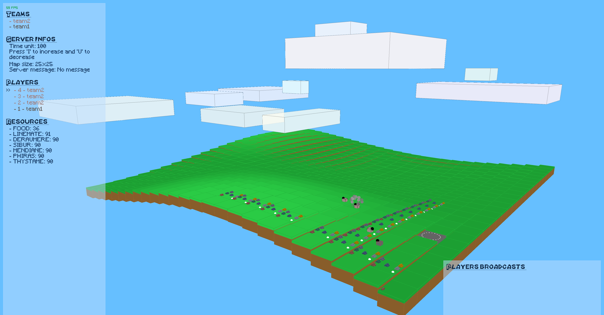
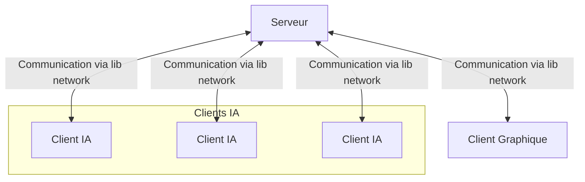

<a name="readme-top"></a>

[![Contributors][contributors-shield]][contributors-url]
[![Stargazers][stars-shield]][stars-url]
[![MIT License][license-shield]][license-url]



# Zappy

<b>binary name:</b> `zappy_server`, `zappy_gui`, `zappy_ai`  
<b>language:</b> C (server), C++ (gui), free (ai)  

> [!NOTE]
> Your Makefile should contain a zappy_server, a zappy_gui and a zappy_airules to compile the eponymous binaries.

> [!TIP]
> You can use the whole C standard library.

The goal of this project is to create a network game where several teams confront each other on a tile map containing resources.  
The winning team is the first one where at least 6 players reach the maximum elevation.  
The following pages describe all the details and constraints.  

## Requirements

- [raylib](https://www.raylib.com/)

## Documentation

For more detailed information, you can consult the PDF documentation:

- [Zappy.pdf](Documentation/Zappy.pdf)
- [Zappy-Graphical.pdf](Documentation/Zappy-Graphical.pdf)

### Global Architecture



## Usage

### Build

```bash
∼/B-YEP-400> make
```

### Run

```bash
∼/B-YEP-400> ./zappy_server -help
USAGE: ./zappy_server -p port -x width -y height -n name1 name2 ... -c clientsNb -f freq
```

```bash
∼/B-YEP-400> ./zappy_gui -help
USAGE: ./zappy_gui -p port -h machine
```

```bash
∼/B-YEP-400> ./zappy_ai -help
USAGE: ./zappy_ai -p port -n name -h machine
```

## Contributions

Project members:
## Contributors

<div>
  <div style="display: flex; flex-wrap: wrap; gap: 20px;">
    <div style="text-align: center; width: 120px;">
      <a href="https://github.com/LouisLanganay">
        
        <br/>
        <span>LouisLanganay</span>
      </a>
      <br/>
      <span>Contributions: 147</span>
    </div>
    <div style="text-align: center; width: 120px;">
      <a href="https://github.com/Neo-Diamons">
        
        <br/>
        <span>Neo-Diamons</span>
      </a>
      <br/>
      <span>Contributions: 52</span>
    </div>
    <div style="text-align: center; width: 120px;">
      <a href="https://github.com/ValentinPeron">
        
        <br/>
        <span>ValentinPeron</span>
      </a>
      <br/>
      <span>Contributions: 43</span>
    </div>
    <div style="text-align: center; width: 120px;">
      <a href="https://github.com/mlargeot">
        
        <br/>
        <span>mlargeot</span>
      </a>
      <br/>
      <span>Contributions: 30</span>
    </div>
    <div style="text-align: center; width: 120px;">
      <a href="https://github.com/Gaulaume">
        
        <br/>
        <span>Gaulaume</span>
      </a>
      <br/>
      <span>Contributions: 11</span>
    </div>
    <div style="text-align: center; width: 120px;">
      <a href="https://github.com/AugustinBst">
        
        <br/>
        <span>AugustinBst</span>
      </a>
      <br/>
      <span>Contributions: 4</span>
    </div>
  </div>
</div>


<p align="right">(<a href="#readme-top">back to top</a>)</p>

[contributors-shield]: https://img.shields.io/github/contributors/LouisLanganay/Zappy.svg?style=for-the-badge
[contributors-url]: https://github.com/LouisLanganay/Zappy/graphs/contributors
[stars-shield]: https://img.shields.io/github/stars/LouisLanganay/Zappy.svg?style=for-the-badge
[stars-url]: https://github.com/LouisLanganay/Zappy/stargazers
[license-shield]: https://img.shields.io/github/license/LouisLanganay/Zappy.svg?style=for-the-badge
[license-url]: https://github.com/LouisLanganay/Zappy/blob/master/LICENSE
